# media-turtle

An old turtle toy repurposed as a media control device.

## The story

My wife was going out shopping with her friend, so I asked her to find me a used toy with buttons on it so I could repurpose it to control my music.  She sends me these two pictures of the candidates she found:

| Candidate 1 | Candidate 2 |
| ----------- | ----------- |
| [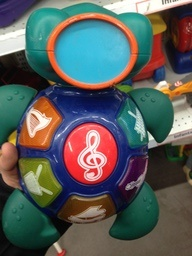](images/Toy_with_buttons1.jpg) | [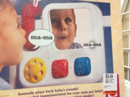](images/Toy_with_buttons2.jpg) |

You can probably guess which one I picked.

As you read through the rest, you may start to wonder why an Arduino Leonardo (which natively supports sending USB keyboard key presses to the host, among other things) wasn't used instead of the Arduino Uno (which does not).  That's mostly because I accidentally ordered an Arduino Uno and I figured I could work around the issue with software.  At first, I was going to write a program that runs on the host and listens for messages sent via the serial connection, but eventually I discovered that some awesome people had worked out how to reprogram one of the chips on the Arduino Uno so it could have its firmware flashed like the main chip.  This makes the solution more portable, on top of the geek credentials involved for [connecting two Arduinos together to update one with the other](https://github.com/NicoHood/HoodLoader2/wiki/Burn-the-bootloader-from-another-Arduino).

### What the toy looked like before I started

Here's a couple of "before" photos.

| Top | Bottom | Inside | Buttons |
| --- | ------ | ------ | ------- |
| [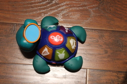](images/Turtle_top.jpg) | [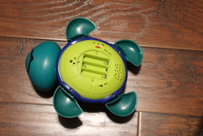](images/Turtle_bottom.jpg) | [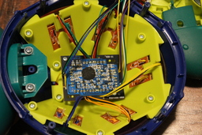](images/Turtle_inside.jpg) | [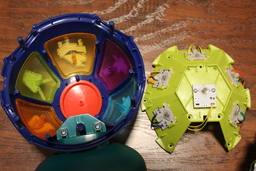](images/Turtle_buttons.jpg) |

## Technical details

Uses [ELEGOO R3 Board ATmega328P ATMEGA16U2](https://www.elegoo.com/product/elegoo-uno-r3-board-atmega328p-atmega16u2-with-usb-cable/), pictured below:

[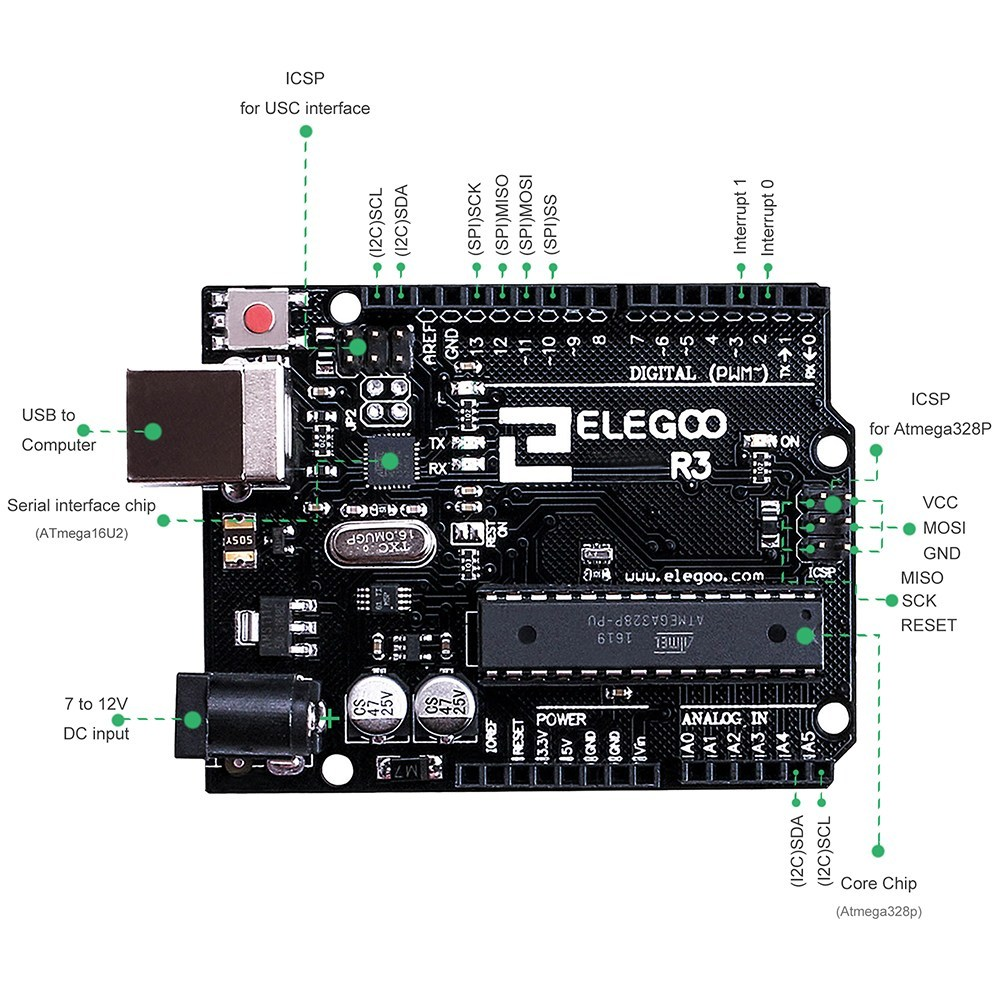](images/ELEGOO_R3_Board.jpg)

### MCU capabilities

This project leverages the basic USB capabilities made possible by Arduino UNO-compatible boards (i.e. based on the ATmega328P, henceforth known as `328P`) that have an ATmega16U2 Microcontroller unit (MCU), henceforth known as `16u2`.

| Capability | `16u2` | `328P` |
| ---------- | ------ | ------ |
| USB        | Y      | N      |
| I/O pins   | ?      | 20     |
| RAM        | 500b   | 2kb    |
| Flash      | 16kb   | 32kb   |

### Pin mappings

Here's how the toy's buttons and lights were wired up to the `328P`'s I/O pins.  The `IO_tester` sketch validates that these are wired up correctly.

| Category       | Name     | Color  | Connection    | Note   |
| -------------- | -------- | ------ | ------------- | ------ |
| Digital (PWM~) | 0->RX    |        |               |        |
| Digital (PWM~) | 1->TX    |        |               |        |
| Digital (PWM~) | 2        |        |               |        |
| Digital (PWM~) | 3~       | Blue   | Xylophone     | Light  |
| Digital (PWM~) | 4        | Yellow | Note          | Button |
| Digital (PWM~) | 5~       | Orange | Violon        | Light  |
| Digital (PWM~) | 6~       | Yellow | Piano         | Light  |
| Digital (PWM~) | 7        | Green  | Harp          | Button |
|                |          |        |               |        |
| Digital (PWM~) | 8        | Yellow | Piano         | Button |
| Digital (PWM~) | 9~       | White  | Drum          | Light  |
| Digital (PWM~) | 10~      |        |               |        |
| Digital (PWM~) | 11~      | Green  | Harp          | Light  |
| Digital (PWM~) | 12       | White  | Drum          | Button |
| Digital (PWM~) | 13       |        |               |        |
|                | GND      |        |               |        |
|                | AREF     |        |               |        |
|                | (I2C)SDA |        |               |        |
|                | (I2C)SCL |        |               |        |
|                |          |        |               |        |
|                | IOREF    |        |               |        |
|                | RESET    |        |               |        |
| Power          | 3.3V     |        |               |        |
| Power          | 5V       |        |               |        |
| Power          | GND      |        |               |        |
| Power          | GND      | Blue   | Common ground |        |
| Power          | Vin      |        |               |        |
|                |          |        |               |        |
| Analog In      | A0       | Blue   | Xylophone     | Button |
| Analog In      | A1       | Orange | Violon        | Button |
| Analog In      | A2       |        |               |        |
| Analog In      | A3       |        |               |        |
| Analog In      | A4       |        |               |        |
| Analog In      | A5       |        |               |        |

### What the toy looked liked midway through

After I removed the old circuit board, soldered some extension cables, connected all the grounds together and plugged them into the Arduino's pins, this is what it looked like:

| Digital side | Analog & power side | Ready to be closed up |
| ------------ | ------------------- | --------------------- |
| [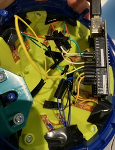](images/Digital_side.jpg) | [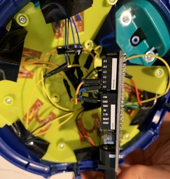](images/Analog_power_side.jpg) | [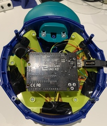](images/Ready_to_close.jpg) |

## The software side

### Design

Unlike the Arduino Leonardo, we can't directly translate a button press into a USB key event: we need to write a sketch for the `328P` that detects button presses, relays them to the `16u2` over the serial connection between the 2 MCUs, then finally write a sketch for the `16u2` to convert instructions received from the `328P` into USB key presses for the host.

### As a diagram

A button press is detected by reading from a pin by the `328P`, it writes a character representing it to the serial port, the `16u2` sees the character and writes it to the USB keyboard:

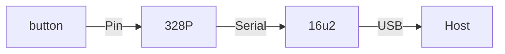

### Implementation

I created the `ButtonBase` class to encapsulate state and events related to a button, with `isPressed()` as "pure virtual" so I could abstract out the difference between buttons implemented using digital pins and analog pins.

```c++
class ButtonBase {
  protected:
    const char _character;
    const uint8_t _buttonPin;
    const uint8_t _ledPin;

    volatile bool _currentButtonState;
    virtual bool isPressed() = 0;

  public:
    void scan() {
      bool newState = isPressed();
      // compare to _currentButtonState
      // optionally toggle the LED
      // send the _character over the serial connection
    }

    ButtonBase(char character, uint8_t buttonPin, uint8_t ledPin) :
      _character(character), _buttonPin(buttonPin), _ledPin(ledPin) {
      // initialize other common parts
    }
};
```

The rest was matter of wiring up; you may notice how the "Pin mappings" table was used to associate the buttons with their corresponding LED (as applicable), as well as the character that would be written when the button is pressed.

```c++
const int NUM_BUTTONS = 6;
ButtonBase * _buttons[NUM_BUTTONS];

void setup() {
  Serial.begin(115200);
  _buttons[0] = new DigitalButton('0',  8,  6);
  _buttons[1] = new DigitalButton('1', 12,  9);
  _buttons[2] = new DigitalButton('3', 15,  5);
  _buttons[3] = new DigitalButton('4',  7, 11);
  _buttons[4] = new DigitalButton('5',  4, -1);
  _buttons[5] = new DigitalButton('6', 14,  3);
}

void loop() {
  for (uint8_t i = 0; i < NUM_BUTTONS; i++) {
    _buttons[i]->scan();
  }
  delay(30);
}
```

## Potential improvements

1. Rather than defining `-1` as the LED pin when a button has no LED, we could define a class to which we delegate button state changes, allowing us to better isolate the behaviors and compose them more elegantly.
1. The `16u2_SerialToUsb` defines a super-simple protocol that passes through any character as a key press then a release. We could support pressing more keys at once, modifiers and matching the button press/release with the key press/release (which would give us the ability to repeat) if we augmented the protocol between the 2 MCUs to better match the Keyboard library's API.
1. Although some of the Arduino's pins are sometimes reserved or overloaded (i.e. dual-purpose) in this particular case, it was probably not necessary to have two buttons based on the analog pins (hence "14" and "15" - those are the digital names of analog pins "0" and "1") and all buttons could have been based on digital pins.
